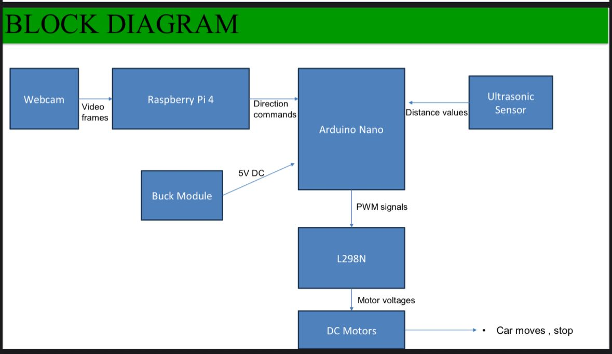

# Autonomous Lane Detection

This project detects road lanes, stop signs, and traffic lights in real-time using OpenCV and deep learning.  
It can control a robot via Arduino or run in detection-only mode.

## Features
- Single lane detection (`1lane.py`)
- Two lane detection (`2lane.py`)
- Stop sign detection (Haar Cascade)
- Traffic light detection & color classification
- Dataset capture tool (`ca.py`)

## Requirements
Install all dependencies:
```bash 
pip install -r requirements.txt
 ```
## Usage
- python 1lane.py       # Single lane mode
- python 2lane.py       # Two lane mode
- python ca.py          # Dataset capture
- python tlight_stop.py # Traffic light & stop sign detection

## Project Diagram


  ---
**Author:** Mohamed Shebeeb  


